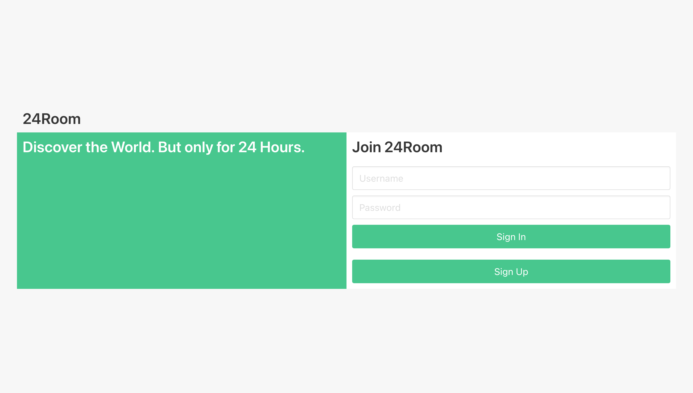
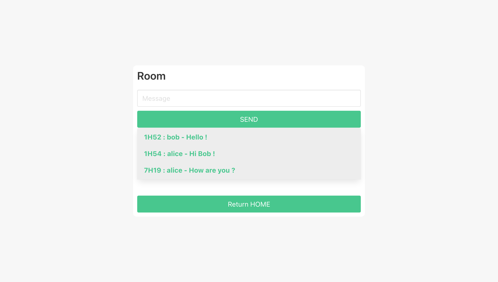

## Introduction
24Room is a social network based on a room system where people can chat with each other. The originality of 24Room lies in the fact that each room is deleted 24 hours after its creation, taking with it the entire conversation. No return is possible. The goal is to put forward and share what each user lives in the present moment because *what is past does not happen anymore and what is future has not happened yet*.

## Installation


```bash
git clone https://github.com/AxelHippolite/INFO734-24RoomChat.git
```
 Open a 2 Terminal Windows in INFO734-24RoomChat directory. In the first one :
```bash
docker run -d --name 24room-bdd -p 27017:27017 mongo
docker run -d --name 24room-redis-bdd -p 6379:6379 redis
npm install
npm run dev
 ```
 In the second one :
```bash
cd website
npm install
npm run dev
 ```
You can now visit [http://localhost:8080/](http://localhost:8080/).

## How does it work ?



Each time you visit the site, you will be taken to the home page. From this page, you can either log in to access the rest of the application or be redirected to the account creation page. As you can see, the site is based on a minimalist and monochrome design. By clicking on "Sign Up" you will be redirected to the account creation page. All you have to do is fill in the 3 required fields.


On the other hand, by connecting, you will arrive on the main page of the site. It is from this page that you will be able to create a room of discussion (via the form "Create Room"), to join a room already existing (by clicking on one of the rooms proposed in the list "Rooms"), to consult the rooms in which you already ecritels a message (by clicking on one of the rooms proposed in the list "Rooms Viewed") and you will be able finally to disconnect you (via the button "Logout" present in top on the left on the navigation bar). Logging out will automatically redirect you to the home page of the site.


By clicking on one of the rooms proposed in the list (each room is indicated by its name and its 5-character identifier) you will be automatically redirected to the room in question from which you can consult old messages and send new ones. Each message will be displayed with the time it was sent, the user who sent it and its content.



## Features

* Account Creation
* Login/Logout
* Message Exchange
* Rooms System
* View Visited Rooms
* Deleting Rooms 24 hours after their Creation
* User Warnings (disconnection, bad filling of fields, ...)

## Future Improvements

Here are the features that were planned in the specifications but will be implemented in the future :

* Password Encryption
* Secure Routes
* Accessing Account Information
* Modification of your User Information
* Account Deletion
* Improved Design and Ergonomics
* Possibility to Send Multimedia Content (Image, GIF, Files, Videos, ...)
* Possibility to Sort Rooms by Topic (Tech, News, Politics, Sports, ...)
* Trends System (the rooms with the most messages exchanged will be highlighted in a specific tab)
* Hall of Fame of the Best Rooms ever Created
